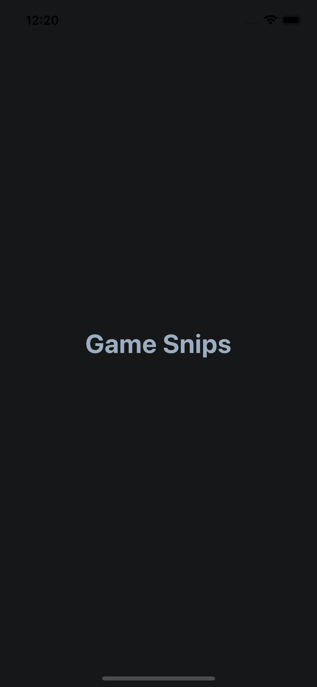
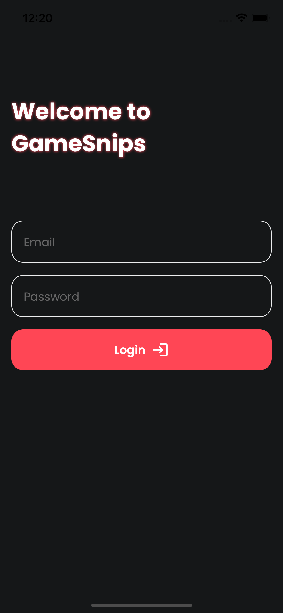
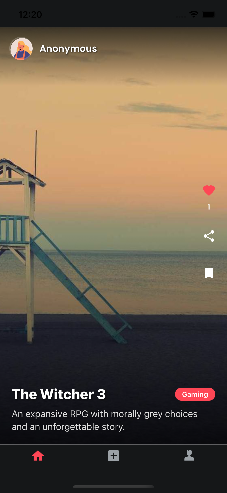
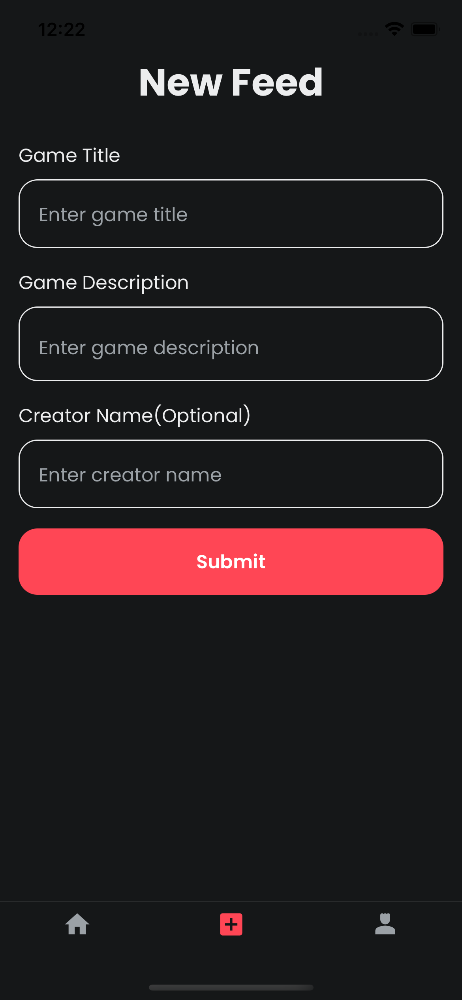

# Game Snips

## Vigneshwaran

## Project Overview
Game Snips is a React Native mobile application built with Expo that provides a platform for gamers to share and discover gaming moments. The app features a modern UI with smooth animations and a robust authentication system.

## Setup Instructions

### Prerequisites
- Node.js (v18 or higher)
- npm (v9 or higher)
- Expo CLI
- iOS Simulator (for Mac) or Android Studio (for Android development)

### Installation
1. Clone the repository
   ```bash
   git clone [repository-url]
   cd GameSnips
   ```

2. Install dependencies
   ```bash
   npm install
   ```

3. Start the development server
   ```bash
   npx expo start
   ```

4. Run on specific platform
   ```bash
   # For iOS
   npx expo run:ios
   
   # For Android
   npx expo run:android
   ```

## Data Persistence
The application uses Firebase as its backend service for the following reasons:
- Real-time database capabilities for instant updates
- Built-in authentication system

## Implemented Features

### Core Features
- User authentication with firebase authetication (email/password)
- Feed with infinite scroll
- Like and comment system
- Profile View

## Architecture Decisions

### Frontend
- **Expo Router**: Chosen for file-based routing and deep linking support
- **React Native Reanimated**: For smooth animations and better performance
- **Formik + Yup**: For form handling and validation
- **Context API**: For state management
- **TypeScript**: For type safety and better developer experience

### Backend
- **Firebase Authentication**: For secure user management
- **Firebase Realtime Database**: For real-time data synchronization

## Known Issues and Limitations
1. pagination for infinite scroll

## Future Improvements
1. Implement image upload with firestore bucket
6. Add analytics and user behavior tracking
7. Implement A/B testing framework

## Test Credentials

| Username | Password |
|----------|----------|
| test@xyz.com | Test@123 |
| test1@xyz.com | Test@123 |

## Screen Shots

| Screenshot 1 | Screenshot 2 | Screenshot 3 | Screenshot 4 | Screenshot 5 |
|--------------|--------------|--------------|--------------|--------------|
|  |  |  |  |  |
